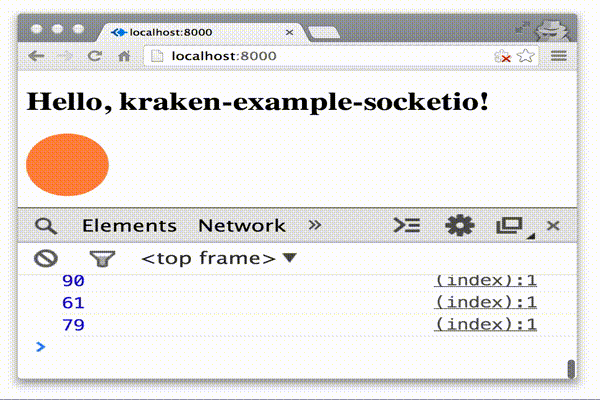

# Kraken_Example_SocketIO

"An example on how to use Kraken with SocketIO on both server-side and client-side"

##Introduction

We will build a simple SocketIO example by generating a random number every half second and using that number to change the size of a circle in the view template.

##Prerequisites

- Node (Version >= 0.10.20 preferred)
- Yeoman and Kraken generator

	```
	npm install -g yo
	npm install -g generator-kraken
	```
	
##Create an application

```
$ yo kraken

     ,'""`.
    / _  _ \
    |(@)(@)|   Release the Kraken!
    )  __  (
   /,'))((`.\
  (( ((  )) ))
   `\ `)(' /'

[?] Application name: Kraken_Example_SocketIO
[?] Description: An example on how to use Kraken with SocketIO on both server-side and client-side
[?] Author: your name
[?] Use RequireJS? (Y/n) n
```

The generator will set up the app and install the dependencies. After it's done, just go into the newly created directory

```
$ cd Kraken_Example_SocketIO
```

##Installing SocketIO

1. For server, include socket.io in `package.json`

	```
	...
	"dependencies": {
        ...
        "socket.io": "0.9.16"
    },
   ...
	```
1. install it

	```
	npm install
	```	
1. For client, copy the file found in `/node_modules/socket.io/node_modules/socket.io-client/dist/socket.io.min.js` to `public/js/lib/socket.io.min.js`	

##Configuring

###server-side

1. Load socket.io as a module in file `index.js`

	```
	// edit from line 29
	...
	if (require.main === module) {
      kraken.create(app).listen(function (err, server) {
        if (err) {
            console.error(err.stack);
        }
        var io = require('./lib/socket').listen(server);
      });
   }
	```
1. add file `lib/socket.js` which will edit a random number every half second

	```
	module.exports.listen = function(app) {

	  io = require('socket.io').listen(app);
	
	  io.sockets.on('connection', function (socket) {
	    setInterval(function(){
	      var num = Math.floor((Math.random()*100)+10)
	      socket.emit('ping', num);
	    }, 500);
	  });
	
	  return io;
	};
	```
	
### client-side
		
1. add the	 relevant javascript in file `/public/templates/layouts/master.dust`

	```
	...
	<!-- before closing the body tag -->
	<script src="js/lib/socket.io.min.js"></script>
	<script>
	  var socket = io.connect('/');
	  socket.on('ping', function (data) {
	    console.log(data);
	    document.getElementById('circle').style.width = data + 'px';
	    document.getElementById('circle').style.height = data + 'px';
	  });
	</script>
	
	</body>
	</html>
	```
1. add the styling in file `/public/templates/layouts/master.dust`

	```
	<!-- Line 6 -->
	...
		<style>
        	#circle {width: 100px; height: 100px; border-radius: 50%; background-color: coral; }
    	</style>
	</head>
	```
1. add the markup in file

	```
	<!-- after line 4 -->
	<div id="circle"></div>
	```
	
##And you're done!

After this, just run `npm start` in the command line.

Visit [localhost:8000](http://localhost:8000/) in the browser and open up console log to see the streams of random numbers.



##References

1. Stackoverflow - [Separating file server and socket.io logic in node.js](http://stackoverflow.com/questions/9709912/separating-file-server-and-socket-io-logic-in-node-js)
1. Stackoverflow - [Loading socket.io as a module in KrakenJS/Express](http://stackoverflow.com/questions/22120696/loading-socket-io-as-a-module-in-krakenjs-express)
1. Kraken issue - [Socket.IO example ](https://github.com/paypal/kraken-js/issues/39)